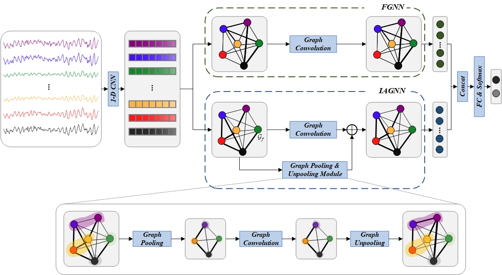

# A Hybrid Graph Neural Network for Enhanced EEG-Based Depression Detection 

- Abstract：Graph neural network (GNN) methods are becoming increasingly popular for EEG-based depression detection. The construction of the graph connection is crucial for improving detection accuracy. The brain connectivity provides valuable guidance for constructing graph connection. There are both fixed (not varying across individuals or over time) and individualized (varying across individuals and over time) connection in the brain. However, previous methods focus only on the fixed part, which limits their performance. To more comprehensively represent brain connectivity for enhanced depression detection, we propose a hybrid graph neural network (HybGNN) model consisting of two GNNs, including both a fixed graph neural network (FGNN) and an instance-adaptive graph neural network (IAGNN). The FGNN infers fixed graph connection by trainable mode without prior knowledge, while the IAGNN presents different graph connection based on different input instances. The two GNNs complement each other, capturing more discriminative characteristics. Moreover, to extract hierarchical information and enhance detection accuracy, a module comprising graph pooling and unpooling (GPUM) is introduced in the IAGNN. Extensive experiments on two public datasets show that our model achieves state-of-the-art performance.
- How to use:
  	- Download and preprocess the dataset
  	- Run main.py
- How to access the dataset:
	- MODMA: [MODMA Dataset (lzu.edu.cn)](https://modma.lzu.edu.cn/data/index/)
	- HUSM: [MDD Patients and Healthy Controls EEG Data (New) (figshare.com)](https://figshare.com/articles/dataset/EEG_Data_New/4244171)
